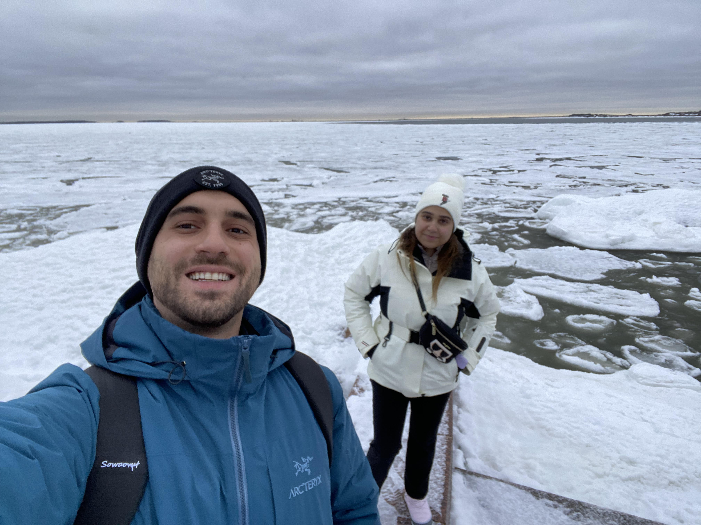
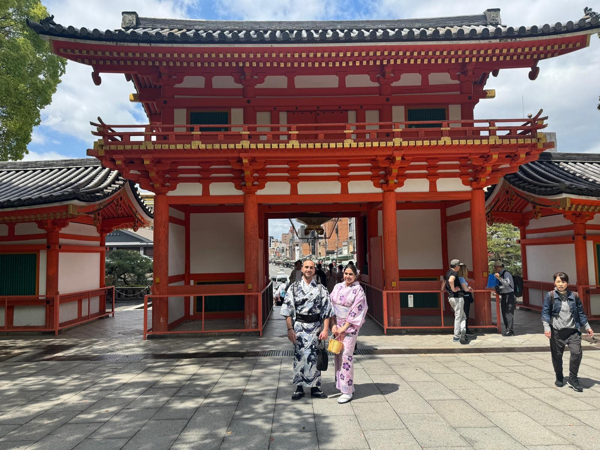

# Data Scientist

Hey there! 👋 I'm Ali El Masri 😃, a data scientist 🧪 with a zest for machine learning and a heart full of adventure!⛷️My journey has been a thrilling ride, much like my love for exploring the Arctic with my wife, where the winter ambiance is simply magical, and skiing through pristine snow is an exhilarating experience.

My story began with small choices and serendipitous encounters. My first high school summer job as an assistant and sailor at a marina in Lebanon was a gateway to fascinating conversations and diverse friendships that sparked my passion for connecting with people.

With a B.A. in Hospitality Management and a rich background in the lodging industry, my career in hospitality was driven by my love for travel and meeting people from all walks of life. Each encounter left an indelible mark, creating lasting memories and shaping my professional path.

After a decade in hospitality across various cities, my curiosity led me to revenue management and eventually to the intellectually stimulating world of data science. I pursued a Master of Science in Data Science from Bellevue University, diving into the depths of machine learning and discovering new techniques that fueled my excitement.

As my academic journey concluded, I realized my learning had just begun. Every new project offers a chance to deepen my knowledge and solve data-driven challenges, particularly in the hospitality and airline industries. By blending my hospitality experience with advanced data science skills, I aim to innovate and help organizations achieve their revenue and guest satisfaction goals.

So, whether I'm analyzing data, exploring the breathtaking Arctic, chasing the Northern Lights, or indulging in the vibrant world of Japanese anime, I'm always on the lookout for new adventures and opportunities to grow!

## Places I've Been

### Home and Native Country
- **Lebanon:** My native country. :lebanon:
- **America:** My home country, with countless adventures across the states. :us:

### North America
- **United States:**
  - **Alaska:** Exploring the wild beauty of the west coast. 🏔️
  - **East Coast:** Visited every state along the east coast. 🗽
- **Canada:**
  - **Montreal:** Embracing the vibrant culture of this historic city. 🍁
  - **Calgary and Banff:** Marveling at the stunning landscapes of the Rockies. ⛰️
- **Mexico:** Enjoying the rich culture and warm beaches. 🇲🇽

### Europe & West Asia
- **Syria:** A journey through history and culture. 🇸🇾
- **Cyprus:** Relaxing on the beautiful Mediterranean island. :cyprus:
- **Bulgaria:** Discovering the charm of Eastern Europe. :bulgaria:
- **Turkey:** Experiencing the unique blend of East and West. :tr:
- **Iceland:** Chasing the Northern Lights and exploring otherworldly landscapes. :iceland:
- **Finland:** Enjoying the winter wonderland and its serene beauty. :finland:
- **Norway:** Skiing and admiring the breathtaking fjords. :norway:
- **Ireland:** Soaking in the lush, green landscapes and vibrant culture. :ireland:
- **Poland:** Exploring the rich history and diverse culture. :poland:

### Asia
- **Maldives:** Relaxing in the stunning tropical paradise. :maldives:
- **Japan:** Immersing in the rich culture and indulging in the vibrant world of anime. :jp:
  

### Caribbean
- **Saint Lucia:** Enjoying the tropical beauty and vibrant culture. :st_lucia:
- **Jamaica:** Embracing the lively music and warm beaches. :jamaica:
- **Dominican Republic:** Relaxing in the tropical paradise. :dominican_republic:

# Resume

## Education

**Bellevue University, Bellevue, NE**  
Master of Science in Data Science (Graduation: September 2024)  
Relevant Coursework: Data Exploration and Analysis, Predictive Analytics, Data Mining, Data Presentation and Visualization, Big Data

**American University of Culture and Education, Beirut**
Bachelor of Arts in Hospitality Management & Administration (Graduated: January 2017)

## Skills

- **Technical**: Proficient in Python, R, Tableau; strong in statistical analysis, data mining, and predictive modeling.
- **Analytical**: Experienced in data preparation, analysis, and visualization; adept at identifying trends and insights from complex datasets.
- **Soft Skills**:  Communication, leadership, and project management skills; committed to ethical considerations in data science.
- **Hotel Management Systems**: PMS including Opera, Fidelio, Galaxy, Lightspeed.

## Professional Experience

**Assistant Operation Manager, Moxy Times Square, New York**  
June 2019 - August 2023  
- Oversaw front office and reservation teams ensuring exceptional guest service for a 612-room hotel.
- Utilized guest feedback and performance data to drive service enhancements and operational decisions.
- Developed and managed associate incentive programs aligning team efforts with organizational goals.
- Played a key role in resource management, optimizing room inventory and planning to achieve operational excellence.

**Front Office Supervisor, Aloft, Brooklyn, New York**  
September 2018 - June 2019  
- Led front desk operations ensuring efficient guest check-in/out processes and adherence to company policies.
- Managed staff scheduling, training, and performance evaluation, fostering a culture of excellence and continuous improvement.
- Implemented financial transaction procedures safeguarding guest.

**Assistant Front Office Manager & Housekeeping Manager, Sheraton Columbia Downtown, South Carolina**  
October 2017 - September 2018  
- Managed housekeeping operations overseeing a team to maintain high cleanliness standards across guestrooms and public spaces.
- Instituted operational protocols and training programs improving service delivery and operational efficiency.
- Conducted regular inspections to ensure adherence to brand standards and guest satisfaction.

**Front Office Manager, Golden Tulip Deville Hotel, Beirut**  
April 2012 - October 2017  
- Spearheaded guest service improvements and operational efficiency through profit-driven adjustments to room rates and inventory management.
- Led cross-functional teams across front desk, concierge, housekeeping, and engineering departments ensuring high service standards and guest satisfaction.
- Implemented training programs enhancing staff proficiency in hotel software and customer service contributing to streamlined operation and crisis management during high-profile events.

## Objective

Aspiring data scientist currently pursuing a Master's in Data Science at Bellevue University with a strong background in hospitality management. Seeking to leverage analytical skills, machine learning, technical proficiency in Python, R, SQL, and a proven track record of leadership and operational excellence to solve complex data-driven problems.

## Key Competencies Developed

- **Leadership and Team Management**: Directed cross-functional teams fostering a collaborative environment and driving performance improvements.
- **Analytical Problem Solving**: Employed data analysis for performance evaluation, inventory management, and operational decision-making.
- **Project Management**: Coordinated with various departments to facilitate event planning and crisis management ensuring seamless operations.
- **Customer Service Excellence**: Implemented training and feedback mechanisms to elevate guest service standards and resolve issues proactively.

## Languages

- English: Professional Proficiency
- Arabic: Professional Proficiency
- French: Professional Proficiency

## Certifications

- Training certificate in Management and Team Building
- Training certificate in Manager Essentials (Performance Management)

# Academic Projects

## Dota2 Performance Analysis

This project focuses on analyzing player behavior and performance in DotA 2 using data collected through the OpenDota API. It includes two approaches, one through R and one through Python. It aims to uncover patterns and correlations between various gameplay elements and match outcomes. The study involves data cleaning, exploratory data analysis, and visualization to identify key factors influencing wins and losses. A logistic regression model is employed to predict match outcomes based on in-game metrics such as kills, assists, hero damage, and economic factors. The findings offer insights into improving gameplay strategies and understanding the dynamics of player performance over time.

[GitHub Repository](https://github.com/elmasri-ali/Dota2-performance-analysis)

## Dota2 Data Extracting Through API and Web Scrapping 

This project focuses on analyzing DotA 2 match data to derive meaningful insights related to gaming performance. The analysis includes data extraction, cleaning, and visualization of match data from various sources such as CSV files, JSON files, API calls, and web scraping.

[GitHub Repository](https://github.com/elmasri-ali/DotA2-API-and-WebScraping)

## Death Classification Model for Himalayan Expeditions

This project involves developing a classification model to predict the probability of death for climbers during Himalayan expeditions. Utilizing historical data from 1905 to 2020 sourced from Kaggle, the project analyzes various factors such as age, gender, experience, peak difficulty, and season of climb. The model aims to identify key determinants that increase the likelihood of fatal outcomes and uses this information to improve the safety planning of future expeditions. Through comprehensive data preprocessing, feature engineering, and the evaluation of multiple machine learning models, the project seeks to create a robust predictive tool for enhancing climber safety.

## Impact of Higher Education and Professional Certificates on Employment and Salary Outcomes

This project investigates the impact of higher education and professional certificates on employment and salary outcomes, particularly within the data science field. It uses datasets from Kaggle and the United States Census Bureau to analyze correlations between educational attainment and earnings. By employing both supervised and unsupervised learning methods, including random forest models and clustering techniques, the project aims to provide insights into the relative effectiveness of formal education versus certifications in enhancing employability and salary potential. The findings are intended to inform learners, educational institutions, and policymakers about the most beneficial educational investments for career advancement.

## Comparative Analysis of Hotel Reviews: A Case Study of New York Marriott Marquis and Competitors

This study offers a detailed comparative analysis of hotel reviews for the New York Marriott Marquis and its top five competitors in New York City. By detecting languages, applying topic modeling, conducting sentiment analysis, and visualizing various metrics, we aim to derive actionable insights. The primary goal is to provide recommendations that can ultimately enhance customer satisfaction and maintain a competitive edge. Of importance, this dataset is not a definitive representation of the hotel’s operations but instead an example for educational purposes derived from a limited set of reviews from 2012.

## Safeguarding the Blue Skies: Airline Safety through Data

This project involves five small data visualization tasks aimed at addressing negative public perception of airline safety due to recent media reports. The tasks include creating an internal dashboard, preparing an executive summary, writing a blog post, designing an infographic, and recording a video presentation. Each task builds on the previous one using data from various sources to analyze and visualize trends and statistics that support the safety of air travel. The dashboard and executive summary are intended for internal review, while the blog post, infographic, and video presentation target external audiences. The project emphasizes effective storytelling, ethical considerations, and appropriate visualization techniques to communicate the airline's message clearly and accurately.

## Predictive Modeling for Hotel Booking Cancellations

This project focuses on predicting hotel booking cancellations using various data mining techniques. By analyzing booking data, the project aims to identify key factors that influence cancellations and develop predictive models to help hotels manage their reservations more effectively.

# Contact

- **Email**: [<i class="fas fa-envelope"></i> almasri.ali92@gmail.com](mailto:almasri.ali92@gmail.com)
- **LinkedIn**: [<i class="fab fa-linkedin"></i> Linkedin](https://www.linkedin.com/in/ali-masri-03347294/)
- **GitHub**: [<i class="fab fa-github"></i> GitHub Profile](https://github.com/elmasri-ali)
